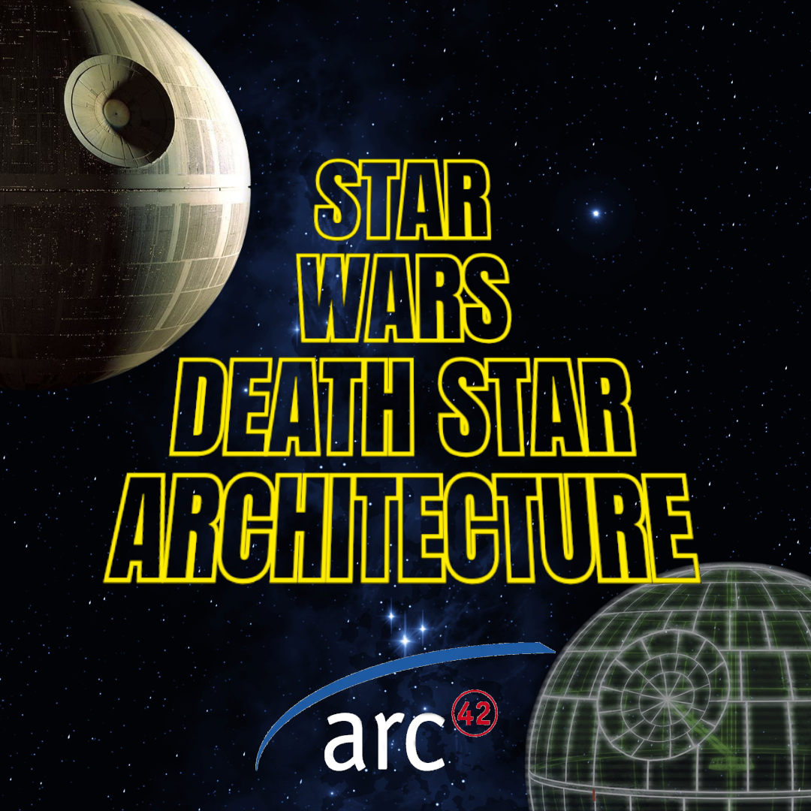

# Star Wars Death Star arc42 Documentation

    

Welcome to the **Star Wars Death Star arc42 Documentation** repository! This project aims to document the fictional architecture of the **Death Star** by applying the **arc42 model**, a popular framework for structured software architecture documentation. Inspired by the Star Wars universe, this project provides an educational example of applying arc42 to a complex system, exploring each section in detail.

## Overview

This repository is organized into two main sections:
- **[English Documentation](docs/EN)** (`docs/EN`): Contains all arc42 sections in English.
- **[Spanish Documentation](docs/ES)** (`docs/ES`): Contains all arc42 sections in Spanish.

## Documentation Sections (English)

1. [00. Overview](docs/EN/00_overview.md)
2. [01. Introduction and Goals](docs/EN/01_introduction_and_goals.md)
3. [02. Constraints](docs/EN/02_constraints.md)
4. [03. Context and Scope](docs/EN/03_context_and_scope.md)
5. [04. Solution Strategy](docs/EN/04_solution_strategy.md)
6. [05. Building Block View](docs/EN/05_building_block_view.md)
7. [06. Runtime View](docs/EN/06_runtime_view.md)
8. [07. Deployment View](docs/EN/07_deployment_view.md)
9. [08. Crosscutting Concepts](docs/EN/08_crosscutting_concepts.md)
10. [09. Architectural Decisions](docs/EN/09_architectural_decisions.md)
11. [10. Quality Requirements](docs/EN/10_quality_requirements.md)
12. [11. Risks and Technical Debt](docs/EN/11_risks_and_technical_debt.md)
13. [12. Glossary](docs/EN/12_glossary.md)

## Resources

The following resources support the documentation:
- **Diagrams**: Architecture diagrams and visuals illustrating different aspects of the Death Star’s system design.
- **Icons**: Icons and other Star Wars-related visuals used for better understanding.

## About arc42

arc42 is a standardized template for documenting software architectures. Developed by software architects for practical, structured documentation, arc42 is widely used for complex systems. This repository uses the Death Star as a fictional case study to demonstrate each arc42 section in practice.

May the documentation be with you!
