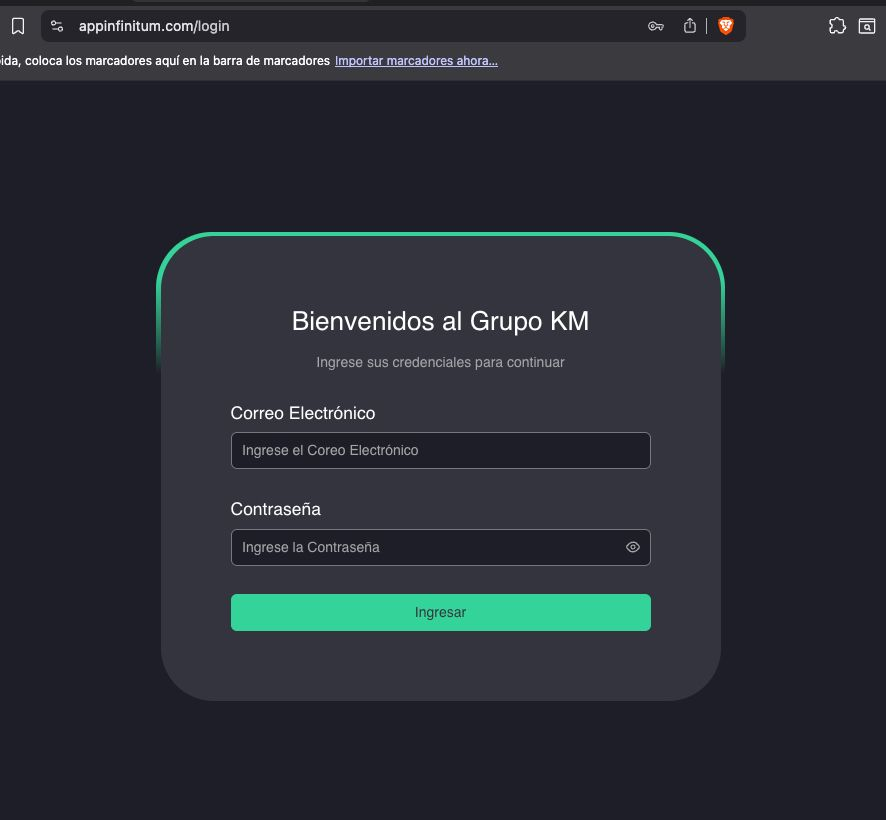

# Documentación de la Aplicacion de Facturacion y Gestion para la Empresa Kmmotos en el Modelo arc42

    

¡Bienvenido al repositorio de **Documentación de la Aplicacion de Facturacion y Gestion para la Empresa Kmmotos con arc42**! Este proyecto tiene como objetivo documentar la arquitectura, infraestructura, Conceptos, temas de interes y despliegue de la **Documentación de la Aplicacion de Facturacion y Gestion para la Empresa Kmmotos** aplicando el modelo de plantilla **arc42**, un marco popular para la documentación estructurada de arquitecturas de software. Esta documentación ofrece un vistaso importante de este sistema complejo, explorando cada sección en detalle.

## Descripción General

Este repositorio está organizado en diversas secciones, que forman parte de la documentación en Español:

- **[Documentación en Español](docs/ES)**(`docs/ES`): Contiene todas las secciones de arc42 en español, para el desarrollo de la documentación.

## Secciones de la Documentación (Español)

1. [00. Resumen](docs/ES/00_resumen.md)
2. [01. Introducción y Objetivos](docs/ES/01_introduccion_y_objetivos.md)
3. [02. Restricciones](docs/ES/02_restricciones.md)
4. [03. Contexto y Alcance](docs/ES/03_contexto_y_alcance.md)
5. [04. Estrategia de Solución](docs/ES/04_estrategia_de_solucion.md)

- pendiente_plantilla

6. [05. Vista de Componentes](docs/ES/pendiente_plantilla/05_vista_de_componentes.md)
7. [06. Vista de Tiempo de Ejecución](docs/ES/pendiente_plantilla/06_vista_de_tiempo_de_ejecucion.md)
8. [07. Vista de Despliegue](docs/ES/pendiente_plantilla/07_vista_de_despliegue.md)
9. [08. Conceptos Transversales](docs/ES/pendiente_plantilla/08_conceptos_transversales.md)
10. [09. Decisiones Arquitectónicas](docs/ES/pendiente_plantilla/09_decisiones_arquitectonicas.md)
11. [10. Requisitos de Calidad](docs/ES/pendiente_plantilla/10_requisitos_de_calidad.md)
12. [11. Riesgos y Deuda Técnica](docs/ES/pendiente_plantilla/11_riesgos_y_deuda_tecnica.md)
13. [12. Glosario](docs/ES/pendiente_plantilla/12_glosario.md)

## Recursos

Los siguientes recursos apoyan la documentación:

- **Diagramas**: Diagramas y visuales de arquitectura que ilustran diferentes aspectos del diseño del sistema.
- **Iconos e Imagenes**: Iconos y otros recursos visuales relacionados con la comprensión del desarrollo.

## Sobre arc42

arc42 es una plantilla estandarizada para la documentación de arquitecturas de software. Desarrollada por arquitectos de software para una documentación práctica y estructurada, arc42 es ampliamente utilizada en sistemas complejos.

## Notas

Responsable: [Luis Jose Arroyo Yusta](https://github.com/lajy-enterprise)

Esta plantilla proviene del ejemplo de [juangcarmona/starwars-deathstar-arc42-documentation:main](https://github.com/juangcarmona/starwars-deathstar-arc42-documentation) y se encuentra bajo la licencia Creative Commons Atribución-NoComercial 4.0 Internacional.

Para más detalles, consulta la [Licencia Creative Commons (CC BY-NC 4.0)](https://creativecommons.org/licenses/by-nc/4.0/deed.es).
