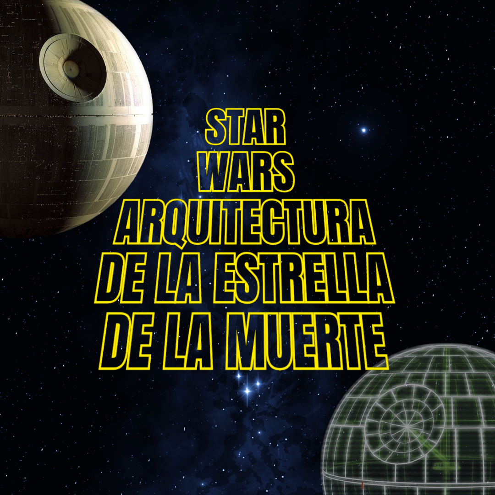

# Documentación de la Estrella de la Muerte en el Modelo arc42

    

¡Bienvenido al repositorio de **Documentación de la Estrella de la Muerte con arc42**! Este proyecto tiene como objetivo documentar la arquitectura ficticia de la **Estrella de la Muerte** aplicando el modelo **arc42**, un marco popular para la documentación estructurada de arquitecturas de software. Inspirado en el universo de Star Wars, este proyecto ofrece un ejemplo educativo de cómo aplicar arc42 a un sistema complejo, explorando cada sección en detalle.

## Descripción General

Este repositorio está organizado en dos secciones principales:
- **Documentación en Inglés** (`docs/EN`): Contiene todas las secciones de arc42 en inglés.
- **Documentación en Español** (`docs/ES`): Contiene todas las secciones de arc42 en español.

## Secciones de la Documentación (Español)

1. [00. Resumen](docs/ES/00_resumen.md)
2. [01. Introducción y Objetivos](docs/ES/01_introduccion_y_objetivos.md)
3. [02. Restricciones](docs/ES/02_restricciones.md)
4. [03. Contexto y Alcance](docs/ES/03_contexto_y_alcance.md)
5. [04. Estrategia de Solución](docs/ES/04_estrategia_de_solucion.md)
6. [05. Vista de Componentes](docs/ES/05_vista_de_componentes.md)
7. [06. Vista de Tiempo de Ejecución](docs/ES/06_vista_de_tiempo_de_ejecucion.md)
8. [07. Vista de Despliegue](docs/ES/07_vista_de_despliegue.md)
9. [08. Conceptos Transversales](docs/ES/08_conceptos_transversales.md)
10. [09. Decisiones Arquitectónicas](docs/ES/09_decisiones_arquitectonicas.md)
11. [10. Requisitos de Calidad](docs/ES/10_requisitos_de_calidad.md)
12. [11. Riesgos y Deuda Técnica](docs/ES/11_riesgos_y_deuda_tecnica.md)
13. [12. Glosario](docs/ES/12_glosario.md)

## Recursos

Los siguientes recursos apoyan la documentación:
- **Diagramas**: Diagramas y visuales de arquitectura que ilustran diferentes aspectos del diseño del sistema de la Estrella de la Muerte.
- **Iconos**: Iconos y otros recursos visuales relacionados con Star Wars para facilitar la comprensión.

## Sobre arc42

arc42 es una plantilla estandarizada para la documentación de arquitecturas de software. Desarrollada por arquitectos de software para una documentación práctica y estructurada, arc42 es ampliamente utilizada en sistemas complejos. Este repositorio utiliza la Estrella de la Muerte como un caso de estudio ficticio para demostrar cada sección de arc42 en la práctica.

¡Que la documentación te acompañe!
