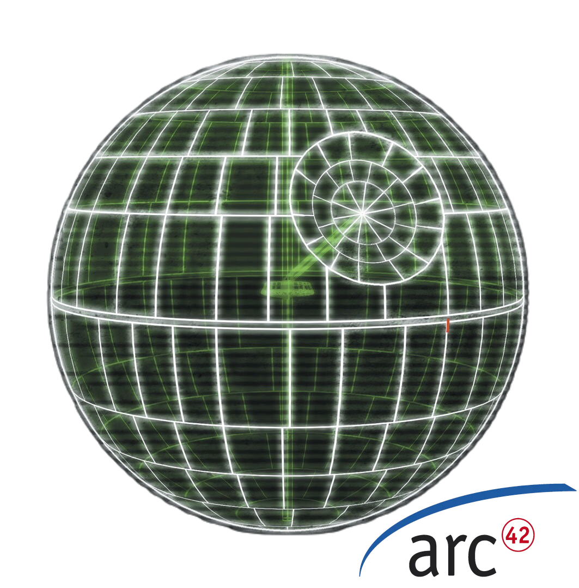

# Documentacion de Aplicacion Km motos Dev 2.0 - Sistema de Gestión Empresarial para Venta de Insumos, repuestos y todo lo relacionado con Motocicletas

## Introducción

Esta documentacion detalla el plan de desarrollo para la aplicación KMMotos, un sistema integral de gestión empresarial diseñado para optimizar las operaciones de una empresa dedicada a la venta de Insumos, repuestos y todo lo relacionado con motocicletas. El proyecto se aborda en fases incrementales, lo que permite una entrega de valor progresiva y una adaptación ágil a las necesidades del negocio.

## Alcance del Proyecto

El alcance de este proyecto se centra exclusivamente en la creación de una aplicación web para gestionar las operaciones internas de KMMotos. No se contempla el desarrollo de aplicaciones móviles (iOS/Android) ni aplicaciones de escritorio y dado que es un dashboard privado para uso interno de la empresa, no es necesario implementar estrategias de SEO (Search Engine Optimization). Sin embargo, se prioriza la facilidad de uso y la optimización para el usuario final, garantizando una experiencia intuitiva y eficiente

## Contenidos

1. [**Introducción y Objetivos**](01_introduccion_y_objetivos.md) - Definición del propósito, partes interesadas y objetivos principales del proyecto.
2. [**Restricciones**](02_restricciones.md) - Restricciones externas e internas que moldean la arquitectura.
3. [**Contexto y Alcance**](03_contexto_y_alcance.md) - Delimitación del alcance, interacciones y dependencias del proyecto con sistemas externos.
4. [**Estrategia de Solución**](04_estrategia_de_solucion.md) - Estrategias centrales y decisiones de alto nivel para el diseño.
5. [**Vista de Componentes**](pendiente_plantilla/05_vista_de_componentes.md) - Componentes estructurales y su organización.
6. [**Vista de Tiempo de Ejecución**](pendiente_plantilla/06_vista_de_tiempo_de_ejecucion.md) - Comportamiento e interacciones de los componentes en escenarios clave.
7. [**Vista de Despliegue**](pendiente_plantilla/07_vista_de_despliegue.md) - Infraestructura y distribución de componentes a través de entornos.
8. [**Conceptos Transversales**](pendiente_plantilla/08_conceptos_transversales.md) - Conceptos técnicos aplicables a múltiples partes del sistema.
9. [**Decisiones Arquitectónicas**](pendiente_plantilla/09_decisiones_arquitectonicas.md) - Decisiones clave de arquitectura y sus motivaciones.
10. [**Requisitos de Calidad**](pendiente_plantilla/10_requisitos_de_calidad.md) - Definición de objetivos de calidad y expectativas de rendimiento del sistema.
11. [**Riesgos y Deuda Técnica**](pendiente_plantilla/11_riesgos_y_deuda_tecnica.md) - Riesgos conocidos y áreas potenciales de deuda técnica.
12. [**Glosario**](pendiente_plantilla/12_glosario.md) - Definiciones de términos importantes específicos de la arquitectura de la Estrella de la Muerte.

## ¡Que la documentación te acompañe

    

