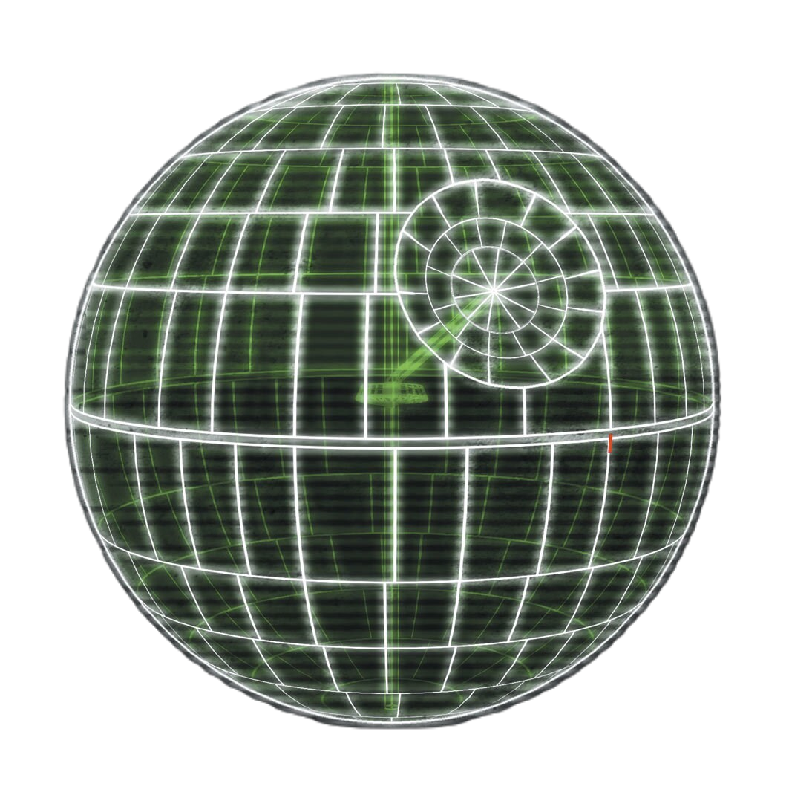

# Arquitectura de la Estrella de la Muerte - Resumen de arc42

## Introducción

Esta documentación proporciona un ejemplo ficticio de cómo documentar la arquitectura de un sistema complejo como la Estrella de la Muerte utilizando el modelo **arc42**. El modelo arc42 estructura la documentación arquitectónica en secciones clave, facilitando la comunicación de las decisiones de diseño, la estructura y los requisitos de sistemas complejos.

## Propósito de Este Ejemplo

A través de este caso de estudio ficticio, nos proponemos:
- Ilustrar cómo se puede aplicar cada sección de arc42 a un sistema avanzado.
- Ofrecer una herramienta educativa para arquitectos de software y fanáticos de Star Wars.
- Demostrar la importancia de la documentación estructurada para identificar riesgos y asegurar la calidad.

## Contenidos

1. [**Introducción y Objetivos**](01_introduction_and_goals.md) - Definición del propósito, partes interesadas y objetivos principales del proyecto Estrella de la Muerte.
2. [**Restricciones**](02_constraints.md) - Restricciones externas e internas que moldean la arquitectura.
3. [**Contexto y Alcance**](03_context_and_scope.md) - Delimitación del alcance, interacciones y dependencias de la Estrella de la Muerte con sistemas externos.
4. [**Estrategia de Solución**](04_solution_strategy.md) - Estrategias centrales y decisiones de alto nivel para el diseño.
5. [**Vista de Componentes**](05_building_block_view.md) - Componentes estructurales y su organización.
6. [**Vista de Tiempo de Ejecución**](06_runtime_view.md) - Comportamiento e interacciones de los componentes en escenarios clave.
7. [**Vista de Despliegue**](07_deployment_view.md) - Infraestructura y distribución de componentes a través de entornos.
8. [**Conceptos Transversales**](08_crosscutting_concepts.md) - Conceptos técnicos aplicables a múltiples partes del sistema.
9. [**Decisiones Arquitectónicas**](09_architectural_decisions.md) - Decisiones clave de arquitectura y sus motivaciones.
10. [**Requisitos de Calidad**](10_quality_requirements.md) - Definición de objetivos de calidad y expectativas de rendimiento de la Estrella de la Muerte.
11. [**Riesgos y Deuda Técnica**](11_risks_and_technical_debt.md) - Riesgos conocidos y áreas potenciales de deuda técnica.
12. [**Glosario**](12_glossary.md) - Definiciones de términos importantes específicos de la arquitectura de la Estrella de la Muerte.

## ¡Que la documentación te acompañe!

    

